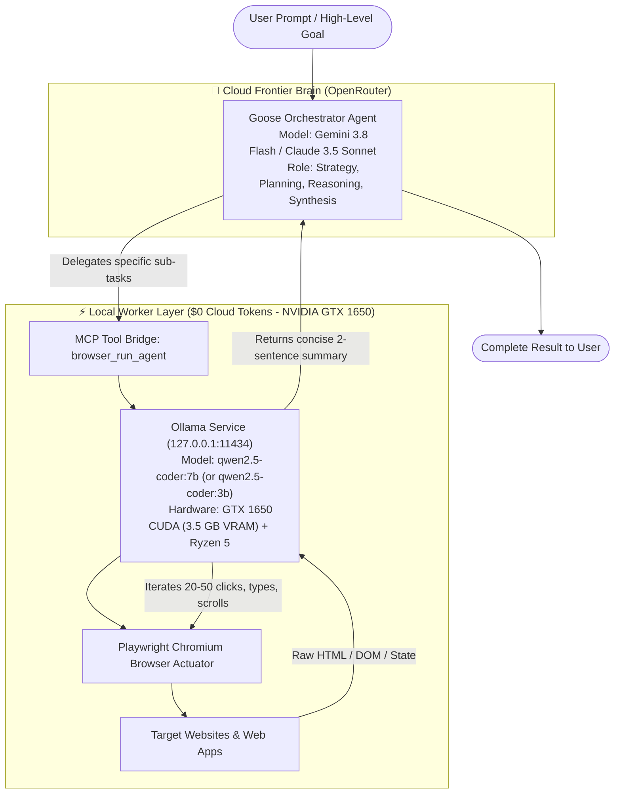

# Hybrid Agent Architecture: Cloud Orchestrator + Local Sub-Agent

## 1. Executive Summary
The **Hybrid Orchestrator-Worker Architecture** solves the two biggest problems in autonomous AI agents:
1. **Cloud Cost & Rate Limits**: 80%–90% of tokens in browser/desktop agents are burned reading huge HTML DOM trees and re-evaluating micro-clicks. Running these in the cloud is expensive ($50–$120/month) and prone to rate limits.
2. **Local Model Reasoning Limitations**: A 7B parameter local model can struggle with multi-hour complex reasoning, fuzzy instruction understanding, and high-level strategy across multiple applications.

By separating the **Brain (Strategic Orchestration)** from the **Hands (Mechanical Execution)**, we achieve frontier intelligence at a **90% discount**.

---

## 2. Architecture Diagram



---

## 3. Financial Analysis & Cost Savings

### Where Tokens Go in Browser Agents
* **Initial Planning**: ~1,500 tokens (Cloud Orchestrator).
* **DOM Snapshots & Inner Loop**: ~10,000 tokens per page inspection × 20 actions = **200,000 tokens** (Local Worker).
* **Final Synthesis**: ~1,000 tokens (Cloud Orchestrator).

### Cost Comparison (per 100 Autonomous Tasks)

| Architecture Model | Cloud Tokens Billed | Est. Cloud Cost | Local Cost | Monthly Total |
| :--- | :--- | :--- | :--- | :--- |
| **Pure Cloud (Claude 3.5 Sonnet)** | ~25,000,000 tokens | **$85.00** | $0.00 | **$85.00** |
| **Pure Cloud (GPT-4o)** | ~25,000,000 tokens | **$65.00** | $0.00 | **$65.00** |
| **Pure Cloud (Gemini 2.5 Flash)** | ~25,000,000 tokens | **$3.75** | $0.00 | **$3.75** |
| **🏆 Hybrid Mode (Gemini Flash + Ollama 7B)** | **~300,000 tokens** | **$0.05** | **$0.00** | **$0.05 (98.6% Savings!)** |
| **🏆 Hybrid Mode (Claude Sonnet + Ollama 7B)** | **~300,000 tokens** | **$1.80** | **$0.00** | **$1.80 (97.8% Savings!)** |

---

## 4. Configuration Reference

In `desktop-agent-workspace/.env`:
```dotenv
# Architecture Mode: hybrid, local, or cloud
EXECUTION_MODE=hybrid

# Orchestrator (Cloud)
OPENROUTER_API_KEY=sk-or-v1-...
OPENROUTER_MODEL=google/gemini-3.8-flash

# Worker (Local)
USE_LOCAL_LLM=true
LOCAL_LLM_PROVIDER=ollama
LOCAL_LLM_MODEL=qwen2.5-coder:7b
LOCAL_LLM_BASE_URL=http://localhost:11434/v1
```

---

## 5. How to Launch

Run `launch_system_control.bat` and pick:
* **Option `[1]`**: **Hybrid Mode** (Cloud Orchestrator + Local Ollama Worker) — *Best balance of intelligence, speed, and cost*.
* **Option `[2]`**: **100% Local** — *Full offline privacy, $0 cloud tokens*.
* **Option `[3]`**: **100% Cloud** — *Pure OpenRouter cloud execution*.
